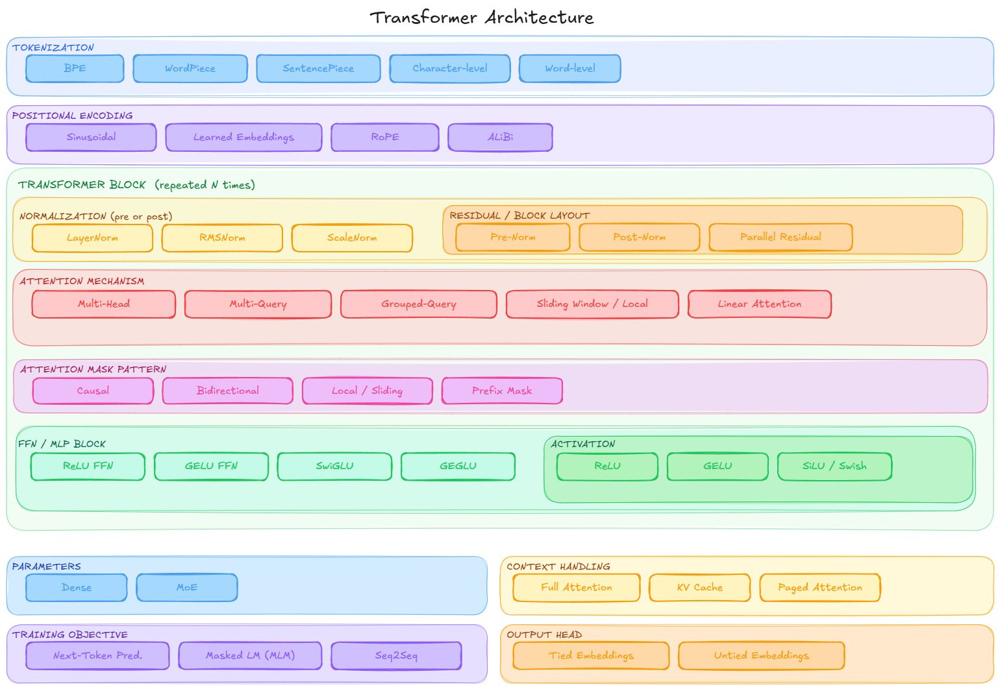

## Transformer Fundamentals

This project is a learning-first implementation of transformer models in PyTorch.If you want to build your first dense language model, this is the mental model to keep in your head.

### Big Picture



A transformer is a neural network that processes a sequence of tokens and learns relationships between them using attention.

For a decoder-only language model, the job is:

> given previous tokens, predict the next token

That is the whole game.

If the model gets good at this, it can generate text, answer questions, write code, and continue patterns.

### What Is A Token

Before the transformer starts, text is converted into tokens.

Example:

```text
"the capital of india is"
```

might become something like:

```text
[102, 587, 44, 9012, 23]
```

The model does not see raw text. It sees token IDs.

### The Must-Have Parts Of A Transformer

For a basic decoder-only transformer, these are the core pieces you must have:

1. Token embedding
2. Positional information
3. Self-attention
4. Feed-forward network
5. Residual connections
6. Normalization
7. Output projection to vocabulary logits

That is the minimum conceptual stack.

### 1. Token Embedding

The model starts with token IDs like `[102, 587, 44]`.

An embedding layer turns each token ID into a dense vector.

So instead of:

```text
token 587
```

you now have something like:

```text
[0.12, -0.44, 1.03, ...]
```

This vector is the learned representation of the token.

Without embeddings, the model only sees integers. With embeddings, it gets a continuous space where similar tokens can have related representations.

### 2. Positional Information

Attention alone does not know order.

These two sequences contain the same words:

```text
dog bites man
man bites dog
```

Without position information, the model would struggle to tell them apart.

So we add positional information to token embeddings.

In this project, that is handled by `PositionalEncoding`.

Modern Llama-style models usually use RoPE instead of classic sinusoidal encoding, but the purpose is the same:

- tell the model where a token is
- help the model reason about order and distance

### 3. Self-Attention

This is the heart of the transformer.

Self-attention answers a simple question:

> for this token, which earlier tokens matter most right now?

For each position, the model computes:

- a query
- a key
- a value

Then it compares the query with all keys, gets attention scores, normalizes them with softmax, and uses those weights to mix values.

Intuition:

- query asks: what am I looking for
- key says: what information do I contain
- value says: what information should I send if selected

### Why This Is Better Than An RNN

An RNN compresses the past into one hidden state.

A transformer keeps access to all earlier token representations and can choose what to focus on.

That is why transformers handle long-range relationships much better.

### 4. Causal Mask

In a decoder-only language model, a token is not allowed to see future tokens during prediction.

If the sequence is:

```text
I love deep learning
```

when predicting `deep`, the model can look at:

```text
I love
```

but not:

```text
learning
```

This is enforced using a causal mask.

That is what makes decoder-only transformers autoregressive.

They generate left to right.

### 5. Multi-Head Attention

Instead of one attention operation, transformers use several heads in parallel.

Why?

Because different heads can learn different patterns.

Examples:

- one head may focus on nearby tokens
- one head may learn subject-verb relations
- one head may learn bracket matching in code
- one head may track long dependencies

At the end, the outputs of all heads are combined.

This gives the model more expressive power than a single attention head.

### 6. Feed-Forward Network

Attention mixes information across tokens.

The feed-forward network processes each token position independently.

You can think of it like this:

- attention = communication between tokens
- feed-forward = computation inside each token representation

In a simple model, this is usually:

```python
Linear -> activation -> Linear
```

This project uses a simple ReLU feed-forward block.

Llama-style models usually use SwiGLU, which is a stronger variant.

### 7. Residual Connections And Normalization

Each block does not fully replace the input. It adds a learned transformation on top of it.

That is the residual connection idea:

```python
x = x + sublayer(x)
```

This helps optimization and keeps training stable.

Normalization layers are also critical. They keep activations in a healthy range.

Common choices:

- LayerNorm
- RMSNorm

This project uses `LayerNorm`.

Llama uses `RMSNorm`.

### 8. Stacking Blocks

One attention block is not enough.

A transformer stacks many blocks one after another.

Very roughly:

- lower layers learn local and surface patterns
- middle layers build richer contextual meaning
- higher layers become more task and prediction oriented

The full decoder-only stack looks like this:

```text
tokens
  -> token embeddings
  -> positional information
  -> block 1
  -> block 2
  -> block 3
  -> ...
  -> final norm
  -> linear projection to vocabulary
  -> next-token logits
```

### 9. Output Projection

At the end, the model must predict the next token.

So the final hidden state is projected to vocabulary size.

If your vocabulary has 50,000 tokens, the model outputs 50,000 logits for each position.

After softmax, that becomes a probability distribution over the next token.

### How A Decoder-Only Transformer Works

Suppose your prompt is:

```text
what is the capital of india
```

The decoder-only model does this:

1. tokenize the text
2. convert token IDs into embeddings
3. add positional information
4. pass embeddings through several causal self-attention blocks
5. produce logits for the next token
6. sample or choose the next token
7. append it to the sequence
8. repeat

So generation looks like:

```text
what is the capital of india
what is the capital of india ?
what is the capital of india ? the
what is the capital of india ? the capital
what is the capital of india ? the capital is
what is the capital of india ? the capital is new
what is the capital of india ? the capital is new delhi
```

There is no separate encoder phase here.

The model builds understanding while processing the sequence itself.

### What Makes Encoder-Decoder Different

In an encoder-decoder transformer:

- the encoder reads the full source input
- the decoder generates output tokens
- the decoder also performs cross-attention to encoder output

That means the decoder has an extra information source.

Flow:

```text
source tokens -> encoder -> encoder representations
target prefix -> decoder -> next target token
```

This is very natural for translation and summarization.

But for general language modeling, decoder-only is simpler and scales well.

### Decoder-Only Fundamentals In This Repo

The decoder-only path lives in:

- `layers/attention.py`
- `layers/embedding.py`
- `layers/feedforward.py`
- `models/decoder_only.py`

The most important class for your goal is:

- `DecoderOnlyTransformer`

Inside it, the must-read pieces are:

- `token_embed`
- `pos_enc`
- `blocks`
- `_causal_mask()`
- `forward()`
- `generate()`

If you understand those, you understand the skeleton of a GPT-style model.

### What This Project Is Good For

This codebase is good for:

- learning the structure clearly
- seeing the major layers separately
- understanding the difference between encoder-decoder and decoder-only
- building a mental model before adding training code

## This Project Vs nanoGPT Vs Llama

### This Project

- educational
- readable
- modular
- shows both encoder-decoder and decoder-only
- great for learning fundamentals

### nanoGPT

- practical tiny GPT trainer
- focused on decoder-only only
- includes training loop and data pipeline
- compact and closer to actual small-scale experimentation

### Llama

- production-grade large decoder-only family
- same high-level transformer idea
- stronger implementation details and scaling choices
- designed for serious training and inference at scale

## If You Want To Build Your First Dense Decoder-Only Model

The cleanest learning path is:

1. understand the current `DecoderOnlyTransformer`
2. strip away encoder-decoder code if it distracts you
3. train on a tiny character-level dataset first
4. overfit a very small text sample
5. add proper generation and checkpointing
6. then gradually adopt more Llama-like choices

## What Changes When we Move Toward Llama

The overall skeleton stays similar.

What changes are mostly the internals:

- sinusoidal positional encoding -> RoPE
- LayerNorm -> RMSNorm
- ReLU FFN -> SwiGLU
- simple attention path -> more optimized inference path
- toy training loop -> real tokenizer, trainer, scheduler, checkpoints

So the foundation is the same, but the production details get stronger.